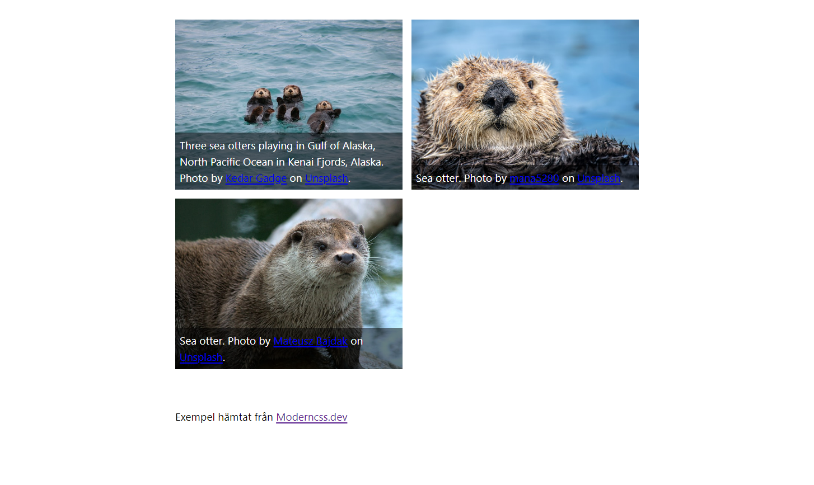

# Bildgalleri

I den här uppgiften ska du skapa ett bildgalleri med hjälp av css grid. Med ett bildgalleri så menas en webbsida som visar upp ett antal bilder.



## Syfte

* Att lära dig grunderna i css grid.
    * Bonus är att det är responsivt.
* Att kunna arbeta med bilder.
    * Redigera storlek och format.
    * Anpassa storlek till innehållet.
* Att använda semantiska taggar:
    * figure
    * figcaption

## Vad behöver du

- [ ] Gör en fork av det här repot.
- [ ] Leta reda på bilder som du vill använda.
    * Bilderna ska ha ett gemensamt tema.
    * Du behöver 3-5 bilder.
    * Du kan använda dig av [Unsplash](https://unsplash.com/) eller [Pexels](https://www.pexels.com/).
    * Var noga med att det är bilder du får använda och publicera.
- [ ] Förstå koden i `index.html`
    * Studera strukturen
    * Varför skrivs innehållet i en lista?
    * Hur fungerar `figure`

## Hur

- [ ] Skapa ett grid med kolumner som är responsiva.
- [ ] Redigera dokumentet så att bilderna visas.
- [ ] Använd dig av figure, figcaption för att förklara bilderna.
- [ ] Arbeta med detta under lektionen.

## Förklaring

Här följer förklaring av css-grid och figure elementet.
Figure elementen skrivs i en lista eftersom innehållet i galleriet passar i en lista.

### CSS för grid

* Skapa grid ` display: grid;`
* Skapa kolumner `grid-template-columns:`
* Skapa antalet kolumner  `repeat(auto-fit, minmax(30ch, 1fr))`
    * Minmax sätter minsta bredden på kolumnen.
* Skapa mellanrum `gap: 1rem;`

```css
    display: grid;
    grid-template-columns: repeat(auto-fit, minmax(30ch, 1fr));
    gap: 1rem;
```

### Figure

Figure-elementet är ett element med innehåll och eventuellt en förklaring av detta. Det är ett semantiskt (meningsbärande) element.

Figure elementet kan användas för att förklara en bild eller en graf. Det kan också användas för att förklara en kodblock eller en annan typ av innehåll.

I elementet kan du använda dig av bild-element eller figcaption-element.

Figcaption används för att förklara innehållet.

```html
<figure>
    
    <figcaption>En utter som sitter på en sten</figcaption>
</figure>
```

## När du är färdig

Då kan du arbeta vidare med att ge galleriet en egen stil. Koppla stilen till bilderna du har valt.

- [ ] Färg
- [ ] Font

Du kan hitta mer att arbeta mer kring grid, figure och det andra på [modercss.dev](https://moderncss.dev/responsive-image-gallery-with-animated-captions/). Läs igenom hela eller delar av sidan.

- [ ] Testa att använda en eller flera delar av exemplet.

- [ ] Skapa individuella sidor för varje bild.

Bilderna ska vara länkade till sina egna sidor. Använd dig av ankar-elementet. Länken behöver omsluta bilden.

```html
<a href="utter1.html"></a>
```

När det är på plats kan du sedan byta ut bilderna på framsidan mot mindre bilder och bilderna på den stora sidan mot större bilder.

För att göra detta så behöver du redigera bilderna. Det kan göras med hjälp av Photoshop eller Paint. Döp bilderna till _thumb eller _large.

Läs mer om [bilder](https://webbutveckling.jensa.dev/media/bilder/).

## Vad kan jag använda detta till

Grid kan användas för att skapa layouter på sidor. Det är ett sätt att skapa mer komplexa layouter. Läs gärna mer.

* https://developer.mozilla.org/en-US/docs/Web/CSS/CSS_Grid_Layout

